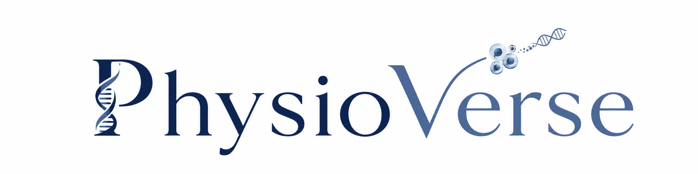

### Open resources for advanced in vitro and microphysiological systems

**PhysioVerse connects data, tools, reproducible workflows, standards activities, learning resources, and community pathways for organoids, tissue chips, body-on-chip systems, engineered tissues, and related human-relevant models.**

<a href="https://physioverse.org/"><strong>Visit PhysioVerse</strong></a>
&nbsp;&nbsp;•&nbsp;&nbsp;
<a href="https://physioverse.org/on-ramp"><strong>Get Started</strong></a>
&nbsp;&nbsp;•&nbsp;&nbsp;
<a href="https://physioverse.org/data-library"><strong>Explore Data</strong></a>
&nbsp;&nbsp;•&nbsp;&nbsp;
<a href="https://physioverse.org/tools"><strong>Explore Tools</strong></a>

  

---

## About PhysioVerse

PhysioVerse is an open ecosystem designed to help the advanced in vitro and microphysiological systems community discover, compare, evaluate, and reuse data, tools, workflows, and supporting resources.

The broader platform connects biological and computational resources across organoids, tissue chips, body-on-chip systems, engineered tissues, and related human-relevant models.

<table>
<tr>
<td width="33%" valign="top">

### Data and Metadata

Discover dataset records, metadata, repositories, and access pathways that support reuse and comparison across studies.

</td>
<td width="33%" valign="top">

### Tools and Workflows

Explore reusable computational resources, benchmarking approaches, analysis workflows, and open technical projects.

</td>
<td width="33%" valign="top">

### Community and Standards

Connect with standards activities, learning resources, contribution pathways, and collaborative initiatives.

</td>
</tr>
</table>

---

## Start Here

<table>
<tr>
<td width="50%" valign="top">

### New to PhysioVerse?

Use the On-Ramp to find the most relevant path based on what you want to explore or contribute.

[**Start on the On-Ramp →**](https://physioverse.org/on-ramp)

</td>
<td width="50%" valign="top">

### Looking for Data?

Explore dataset records, metadata, repository links, and available access information.

[**Explore the Data Library →**](https://physioverse.org/data-library)

</td>
</tr>
<tr>
<td width="50%" valign="top">

### Looking for Tools?

Explore computational tools, workflows, benchmarking resources, and reusable technical components.

[**Explore Tools →**](https://physioverse.org/tools)

</td>
<td width="50%" valign="top">

### Want to Contribute?

Contribute data and metadata or connect with broader PhysioVerse participation pathways.

[**Contribute to PhysioVerse →**](https://physioverse.org/submit-data)

</td>
</tr>
</table>

---

## PhysioVerse Ecosystem

| Area | Explore |
|---|---|
| **Data Library** | [Discover data and metadata](https://physioverse.org/data-library) |
| **Tools** | [Explore tools and workflows](https://physioverse.org/tools) |
| **Standards Exchange** | [Explore standards activities](https://physioverse.org/standards-exchange) |
| **Learning Network** | [Explore learning resources](https://physioverse.org/learning-network) |
| **Community** | [Connect with the community](https://physioverse.org/community) |
| **GitHub Resources** | [Explore the public GitHub pathway](https://physioverse.org/github) |
| **On-Ramp** | [Find your starting point](https://physioverse.org/on-ramp) |

---

## Featured Public Repositories

<table>
<tr>
<td width="50%" valign="top">

### Toward Standardization

Reference-anchored benchmarking for evaluating how closely advanced in vitro models reflect an appropriate biological reference.

[**Explore the repository →**](https://github.com/PhysioVerse-OSE/toward-standardization)

</td>
<td width="50%" valign="top">

### DGE Tool Choice Benchmark

Reproducible workflows for evaluating edgeR and DESeq2 across sensitivity, robustness, pathway interpretation, and cross-study performance.

[**Explore the repository →**](https://github.com/PhysioVerse-OSE/dge-tool-choice-benchmark)

</td>
</tr>
</table>

---

## Why This Matters

Advanced in vitro systems are increasingly used in disease modeling, toxicity assessment, therapeutic development, biological discovery, and translational science.

Their broader value depends on the ability to understand how models were generated, how data were analyzed, how systems compare with relevant biological references, and how results can be reproduced across laboratories.

PhysioVerse supports these goals by connecting open data, transparent workflows, benchmarking resources, standards activities, learning materials, and community participation.

---

  <a href="https://physioverse.org/"><strong>PhysioVerse.org</strong></a>
  &nbsp;&nbsp;•&nbsp;&nbsp;
  <a href="https://physioverse.org/community"><strong>Community</strong></a>
  &nbsp;&nbsp;•&nbsp;&nbsp;
  <a href="https://physioverse.org/github"><strong>GitHub Resources</strong></a>
  &nbsp;&nbsp;•&nbsp;&nbsp;
  <a href="https://physioverse.org/contact"><strong>Contact</strong></a>

